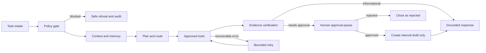

# Northstar Operations Agent: Architecture

Northstar is one supervised operations agent for knowledge work. It is designed to turn a staff member’s request into a bounded, traceable sequence of research, retrieval, analysis, draft preparation, and human-reviewed action proposals. It is not an unconstrained chatbot, autonomous browser, or unrestricted integration hub.

## Agent job

The agent helps a firm answer a question from approved knowledge, analyse a permitted structured file, research a public fact, compare evidence, and create a reviewed internal draft. It can make bounded routing and planning decisions. It does not send messages, edit company records, purchase items, run shell commands, or delete data.

## LangGraph execution model

The graph stores a stable run and thread identifier, evaluates rules before an LLM plans, invokes only registered tools, writes a trace after each transition, and treats every non-read action as a reviewable draft. The workflow stays resumable through persisted state and approval records.

## Tool tiers

| Tier | Tools | Capability | Control |
|---|---|---|---|
| 0 | Policy, context, memory | Reads only from application records. | Deterministic validation and audit. |
| 1 | Knowledge search, structured data, public research | Read-only evidence gathering. | Tool allowlist, input schema, timeout, result limits, trace. |
| 2 | Internal draft preparation | Creates an internal, reviewable artifact. | Draft-only record, provenance, reviewer queue. |
| 3 | Connected company actions | Disabled by default. | Specific human approval, least-privilege scope, idempotency key, audit; not implemented as a direct effect. |

## State and memory

Run state is short-term working context: task, plan, risk label, tool events, evidence, draft proposal, retry count, and terminal status. It is persisted after every graph node. Long-term memory is separate, scoped to a user or firm, and only contains explicit approved preferences, durable business facts, or approved team context. Retrieved content and tool output do not become memory automatically.

## Recovery and observability

Each tool call has a bounded timeout, a retry budget, an idempotency key, a sanitized result summary, and a failure class. The agent marks an execution as **failed for review** if it cannot recover. It records a run trace, state snapshots, tool calls, approvals, and output quality signals. Evaluations measure route choice, policy outcome, tool choice and argument validity, retrieval relevance, evidence grounding, refusal correctness, workflow terminal state, latency, and feedback.

## Deployment and integrations

The repository is deployable as the provided Node/React application. It uses database-backed state and object storage for documents. A Qdrant-compatible adapter is optional for vector search; the secure local hybrid retrieval fallback keeps initial deployment functional. Connected systems remain disabled until credentials are configured with least privilege. The first integrations should be read-only sources or draft-only targets.

## Design sources

The architecture follows LangGraph’s state, nodes, conditional edges, persistence, interrupt, and durable execution concepts; LangChain’s bounded tool and multi-agent patterns; OWASP’s least-privilege and explicit-authorization practices; and the NIST AI RMF’s risk management approach.[1] [2] [3] [4]

## References

[1]: https://docs.langchain.com/oss/python/langgraph/overview "LangGraph overview"
[2]: https://docs.langchain.com/oss/python/langgraph/agentic-rag "Build a custom RAG agent with LangGraph"
[3]: https://cheatsheetseries.owasp.org/cheatsheets/AI_Agent_Security_Cheat_Sheet.html "OWASP AI Agent Security Cheat Sheet"
[4]: https://www.nist.gov/itl/ai-risk-management-framework "NIST AI Risk Management Framework"
